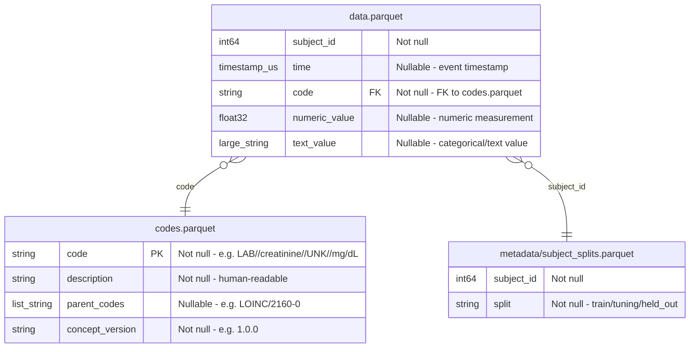

# ELF: Event Language Framework

**A Harmonized Event Language for Clinical AI/ML**

---

## Overview

### The Problem

Clinical AI/ML for decision support is fragmented, non-portable, and non-reproducible. Phenotyping algorithms are tightly coupled to source-specific schemas — researchers must understand the internal code structure of each dataset before writing a single query. Models trained on one institution's data cannot be applied to another without extensive re-engineering. There is no shared "language" for clinical events.

### Building on MEDS

ELF adopts the MEDS event-based data format. [MEDS](https://github.com/Medical-Event-Data-Standard/meds) provides a simple, flat structure for longitudinal EHR data, but it does not standardize medical code vocabularies. Medical data can be encoded in many different ways, varying from different international standards like SNOMED to country-specific code sets, and even hospital-specific codes. MEDS does not require any particular set of codes, so different MEDS datasets can and will use very different standards. While this is usually not an issue for modeling, it is important for phenotyping, as clinical knowledge of a particular code set is usually required to write phenotyping algorithms.

### The ELF Approach

ELF is an encoding framework that adopts the MEDS data schema with MEDS-compatible column names (`subject_id`, `time`, `code`, `numeric_value`, `text_value`). It defines a **fixed mCIDE vocabulary** that cleans and harmonizes arbitrary source codes into standardized concepts, each linked to external ontologies (LOINC, RxNorm, SNOMED CT). Any clinical dataset can produce ELF output through per-domain YAML configuration files with multi-source concept mappings. Phenotyping logic written against mCIDE concepts works identically across all ELF datasets.

### Comparison to MEDS

| Feature | MEDS | ELF |
|---------|------|-----|
| Schema | Single flat table | MEDS-compatible data + ELF code metadata |
| Ontology | None (free-text codes) | mCIDE with external ontology links |
| Vocabulary | Arbitrary strings | Fixed harmonized mCIDE vocabulary |
| Code standardization | Not standardized | LOINC, RxNorm, SNOMED CT |
| Concept IDs | Arbitrary strings | `{domain}//{mcide}//{action}//{unit}` scheme |
| Column names | `subject_id`, `time`, `code`, ... | Same MEDS columns |
| Interoperability | Source-dependent | Source-agnostic via per-domain config |
| Phenotyping portability | Per-dataset logic | Write once, run on any ELF dataset |
| Transformer readiness | Variable vocabulary | Fixed vocabulary for token-based models |
| External codes | Not supported | LOINC, RxNorm, SNOMED CT via `parent_codes` |
| Scope | General EHR | General clinical with ICU depth |

---

## Transformer-Based Models

ELF's fixed mCIDE vocabulary is designed for token-based transformer models. Because the vocabulary is stable across datasets, a model trained on one ELF-formatted corpus can be applied to any other without vocabulary drift or token remapping. The mCIDE elements act as a stable token alphabet — no out-of-vocabulary surprises, no dataset-specific embeddings.

---

## Entity-Relationship Diagram



---

## Output Tables

### data.parquet — MEDS DataSchema

The central fact table. Each row is one clinical event. Pure MEDS columns, no ELF extensions.

| Column | Type | Nullable | Origin | Description |
|--------|------|----------|--------|-------------|
| `subject_id` | `int64` | No | MEDS | Patient identifier |
| `time` | `timestamp[us]` | Yes | MEDS | Event timestamp |
| `code` | `string` | No | MEDS | mCIDE concept code (e.g., `LAB//creatinine//UNK//mg/dL`) |
| `numeric_value` | `float32` | Yes | MEDS | Numeric measurement |
| `text_value` | `large_string` | Yes | MEDS | Categorical/text value |

**Constraints:**
- `code` must exist in `codes.parquet`
- MEDS standard codes `MEDS_BIRTH` and `MEDS_DEATH` are reserved for birth/death events
- For `type: value` concepts: `numeric_value` is populated, `text_value` is null
- For `type: text` concepts: `text_value` is populated, `numeric_value` is null
- For `type: presence` concepts: `numeric_value` = 1.0, `text_value` is null
- `time` is null only for static demographics (sex, race, ethnicity)

### codes.parquet — MEDS CodeMetadataSchema + concept_version

The dimension table defining all mCIDE concepts. Built from domain config files at conversion time.

| Column | Type | Nullable | Origin | Description |
|--------|------|----------|--------|-------------|
| `code` | `string` (PK) | No | MEDS | mCIDE concept code (e.g., `VITAL//heart_rate//UNK//bpm`) |
| `description` | `string` | No | MEDS | Human-readable description |
| `parent_codes` | `list[string]` | Yes | MEDS | External ontology links (e.g., `["LOINC/2160-0"]`) |
| `concept_version` | `string` | No | ELF | Semantic version from domain config (e.g., `1.0.0`) |

**Constraints:**
- `code` is the primary key (unique, not null)
- `concept_version` tracks which domain config version produced each concept

### metadata/subject_splits.parquet — MEDS SubjectSplitSchema

Patient-level random assignment for ML workflows.

| Column | Type | Nullable | Description |
|--------|------|----------|-------------|
| `subject_id` | `int64` | No | Patient identifier |
| `split` | `string` | No | `train`, `tuning`, or `held_out` |

**Constraints:**
- All events for a subject are in the same split
- Default ratio: 70% train, 15% tuning, 15% held_out
- Deterministic with seed=42

### metadata/dataset.json — MEDS DatasetMetadataSchema

Standard MEDS metadata: `dataset_name`, `dataset_version`, `etl_name`, `etl_version`, `meds_version`.

---

## mCIDE ID Scheme

Format: `{domain}//{mcide}//{action}//{unit}`

- `//` is the component delimiter
- `/` (single) is reserved for use within units (e.g., `mg/dL`, `mcg/kg/min`)
- `action` is `UNK` when there is no clear action (most domains)
- RESP domain uses `set` (ventilator setting) and `obs` (observed measurement) as actions
- MED domain uses `mar` (medication administration record) as an action
- Text-type concepts use `text` as the unit
- Presence-type concepts use `presence` as the unit
- Score-type concepts use `score` as the unit

| Domain | Prefix | Description |
|--------|--------|-------------|
| Vitals | `VITAL//` | Vital signs |
| Labs | `LAB//` | Laboratory results |
| Medications | `MED//` | Continuous infusions |
| Respiratory | `RESP//` | Respiratory support parameters |
| Assessments | `ASSESS//` | Clinical assessment scales |
| Therapies | `THERAPY//` | Organ support therapies (ELF-defined) |
| Demographics | `DEMO//` | Patient demographics |
| ADT | `ADT//` | Admissions/discharges/transfers |
| Billing Dx | `BILLING_DX//` | Raw ICD billing diagnosis codes (pass-through) |

> Concept counts are defined by the [CLIF mCIDE vocabulary](https://github.com/Common-Longitudinal-ICU-data-Format/CLIF/tree/main/mCIDE) CSVs (the source of truth), except THERAPY which is ELF-defined.

---

## mCIDE Concept Catalog

### VITAL — Vital Signs

> Full category list: [`clif_vitals_categories.csv`](https://github.com/Common-Longitudinal-ICU-data-Format/CLIF/tree/main/mCIDE/vitals/clif_vitals_categories.csv)

| code | Description | Parent Codes |
|------|-------------|--------------|
| `VITAL//heart_rate//UNK//bpm` | Heart rate (beats per minute) | `LOINC/8867-4` |
| `VITAL//temperature//UNK//C` | Body temperature (Celsius) | `LOINC/8310-5` |
| `VITAL//oxygen_saturation//UNK//%` | Peripheral oxygen saturation (%) | `LOINC/59408-5` |

### LAB — Laboratory Results

> Full category list: [`clif_lab_categories.csv`](https://github.com/Common-Longitudinal-ICU-data-Format/CLIF/tree/main/mCIDE/labs/clif_lab_categories.csv)

| code | Description | Parent Codes |
|------|-------------|--------------|
| `LAB//creatinine//UNK//mg/dL` | Serum creatinine (mg/dL) | `LOINC/2160-0` |
| `LAB//hemoglobin//UNK//g/dL` | Hemoglobin (g/dL) | `LOINC/718-7` |
| `LAB//lactate//UNK//mmol/L` | Serum lactate (mmol/L) | `LOINC/2524-7` |

### MED — Continuous Medications

> Full category list: [`clif_medication_admin_continuous_med_categories.csv`](https://github.com/Common-Longitudinal-ICU-data-Format/CLIF/tree/main/mCIDE/medication_admin_continuous/clif_medication_admin_continuous_med_categories.csv)

| code | Description | Parent Codes |
|------|-------------|--------------|
| `MED//norepinephrine//UNK//mcg/kg/min` | Norepinephrine continuous infusion | `RxNorm/7512` |
| `MED//propofol//UNK//mcg/kg/min` | Propofol continuous infusion | `RxNorm/8782` |
| `MED//fentanyl//UNK//mcg/kg/hr` | Fentanyl continuous infusion | `RxNorm/4337` |

### RESP — Respiratory Support

> Device categories: [`clif_respiratory_support_device_categories.csv`](https://github.com/Common-Longitudinal-ICU-data-Format/CLIF/tree/main/mCIDE/respiratory_support/clif_respiratory_support_device_categories.csv)
> Mode categories: [`clif_respiratory_support_mode_categories.csv`](https://github.com/Common-Longitudinal-ICU-data-Format/CLIF/tree/main/mCIDE/respiratory_support/clif_respiratory_support_mode_categories.csv)

| code | Description | Parent Codes |
|------|-------------|--------------|
| `RESP//fio2//set//%` | FiO2, set (%) | `LOINC/3150-0` |
| `RESP//tidal_volume//obs//mL` | Tidal volume, observed (mL) | `LOINC/76009-0` |
| `RESP//peep//set//cmH2O` | PEEP, set (cmH2O) | `LOINC/76248-4` |

### ASSESS — Clinical Assessments

> Full category list: [`clif_patient_assessment_categories.csv`](https://github.com/Common-Longitudinal-ICU-data-Format/CLIF/tree/main/mCIDE/patient_assessments/clif_patient_assessment_categories.csv)

| code | Description | Parent Codes |
|------|-------------|--------------|
| `ASSESS//gcs_total//UNK//score` | Glasgow Coma Scale total score (3-15) | `LOINC/9269-2` |
| `ASSESS//rass//UNK//score` | Richmond Agitation-Sedation Scale (-5 to +4) | `LOINC/54632-5` |

### THERAPY — Organ Support Therapies (ELF-defined)

| code | Description | Parent Codes |
|------|-------------|--------------|
| `THERAPY//crrt//UNK//presence` | Continuous renal replacement therapy | — |
| `THERAPY//ecmo_mcs//UNK//presence` | ECMO / mechanical circulatory support | — |

### DEMO — Demographics

> Patient categories: [`mCIDE/patient/`](https://github.com/Common-Longitudinal-ICU-data-Format/CLIF/tree/main/mCIDE/patient) (sex, race, ethnicity CSVs)
> Discharge categories: [`clif_hospitalization_discharge_categories.csv`](https://github.com/Common-Longitudinal-ICU-data-Format/CLIF/tree/main/mCIDE/hospitalization/clif_hospitalization_discharge_categories.csv)

| code | Description | Type | Parent Codes |
|------|-------------|------|--------------|
| `DEMO//sex//UNK//text` | Patient biological sex | text | — |
| `DEMO//race//UNK//text` | Patient race category | text | — |
| `DEMO//discharge_category//UNK//text` | Hospital discharge disposition | text | — |

### ADT — Admissions/Discharges/Transfers

> Location categories: [`clif_adt_location_categories.csv`](https://github.com/Common-Longitudinal-ICU-data-Format/CLIF/tree/main/mCIDE/adt/clif_adt_location_categories.csv)
> ICU location types: [`clif_adt_location_type.csv`](https://github.com/Common-Longitudinal-ICU-data-Format/CLIF/tree/main/mCIDE/adt/clif_adt_location_type.csv)

ADT uses a 3-component format: `ADT//{location_category}//{location_type}`
- `location_type` is `UNK` for non-ICU categories
- `location_type` specifies ICU subtype when `location_category` is `icu`

| code | Description |
|------|-------------|
| `ADT//ed//UNK` | Emergency Department |
| `ADT//icu//medical_icu` | Medical ICU |
| `ADT//ward//UNK` | General ward |

### BILLING_DX — Raw ICD Billing Diagnosis Codes (pass-through)

Unlike other domains where concepts are fixed mCIDE codes, `BILLING_DX` passes through raw ICD billing diagnosis codes directly from the source data. The domain config defines where to find ICD codes in each source — the codes themselves are not enumerated in the config.

Output codes follow the format: `BILLING_DX//ICD{version}//UNK//{code}` (e.g., `BILLING_DX//ICD10CM//UNK//E11.9`). The concept count is dynamic — determined by the source dataset, not the config.

### MEDS Standard Codes

ELF includes two MEDS-standard event codes defined by the MEDS schema itself. These are not mCIDE concepts and retain their MEDS format:

| code | Description |
|------|-------------|
| `MEDS_BIRTH` | Patient birth event |
| `MEDS_DEATH` | Patient death event |

---

## Split Logic

### Algorithm

1. Collect all unique `subject_id` values
2. Shuffle deterministically (seed=42)
3. Assign splits: 70% `train`, 15% `tuning`, 15% `held_out`
4. All events for a subject inherit the same split

### Rationale

Patient-level splitting prevents data leakage — no patient appears in multiple splits.

---

## Config Architecture

### Directory Layout

```
config/
├── concepts/            # Default domain configs (shipped with ELF)
│   ├── VITAL.yaml       # Vital sign concepts
│   ├── LAB.yaml         # Lab concepts
│   ├── MED.yaml         # Medication concepts
│   ├── RESP.yaml        # Respiratory concepts
│   ├── ASSESS.yaml      # Assessment concepts
│   ├── THERAPY.yaml     # Therapy concepts
│   ├── DEMO.yaml        # Demographic concepts
│   ├── ADT.yaml         # ADT concepts
│   └── BILLING_DX.yaml  # Raw ICD billing diagnosis codes (pass-through)
└── extensions/          # User extensions (one or more YAML files)
    └── *.yaml
```

### Domain YAML Structure

Each domain config defines concepts and their source mappings:

```yaml
# config/concepts/LAB.yaml
domain: LAB
version: 1.0.0
description: Laboratory results

concepts:
  LAB//creatinine//UNK//mg/dL:
    description: Serum creatinine (mg/dL)
    type: value
    parent_codes:
      - LOINC/2160-0
    sources:
      clif:
        table: labs
        category_column: lab_category
        value_column: lab_value
        filter: creatinine
        timestamp_column: lab_collect_dttm
      mimic_iv:
        table: labevents
        category_column: itemid
        value_column: valuenum
        filter: 50912
        timestamp_column: charttime

  LAB//hemoglobin//UNK//g/dL:
    description: Hemoglobin (g/dL)
    type: value
    parent_codes:
      - LOINC/718-7
    sources:
      clif:
        table: labs
        category_column: lab_category
        value_column: lab_value
        filter: hemoglobin
        timestamp_column: lab_collect_dttm
      mimic_iv:
        table: labevents
        category_column: itemid
        value_column: valuenum
        filter: 51222
        timestamp_column: charttime
  # ... remaining lab concepts
```

### Pass-Through Domain: BILLING_DX

```yaml
# config/concepts/BILLING_DX.yaml
domain: BILLING_DX
version: 1.0.0
description: Raw ICD billing diagnosis codes (pass-through)
mode: pass_through    # Codes come from source data, not predefined
code_prefix: BILLING_DX

sources:
  clif:
    table: hospital_diagnosis
    code_column: icd_code
    code_version_column: icd_version
    timestamp_column: discharge_dttm
  mimic_iv:
    table: diagnoses_icd
    code_column: icd_code
    code_version_column: icd_version
    timestamp_column: dischtime
```

### User Extension YAML

Users extend ELF by placing YAML files in `config/extensions/`:

```yaml
# config/extensions/my_hospital_labs.yaml
extends_domain: LAB
version: 1.0.0

concepts:
  # Add a new source mapping to an existing concept (override required)
  LAB//creatinine//UNK//mg/dL:
    override: true
    sources:
      my_hospital:
        table: lab_results
        category_column: test_code
        value_column: result
        filter: CREA
        timestamp_column: result_time

  # Add a new concept entirely
  LAB//d_dimer//UNK//ng/mL:
    description: D-dimer (ng/mL)
    type: value
    parent_codes:
      - LOINC/48065-7
    sources:
      my_hospital:
        table: lab_results
        category_column: test_code
        value_column: result
        filter: DDIM
        timestamp_column: result_time
```

### Extension Registration

Extensions are discovered from `config/extensions/`. Optionally, a `config/extensions/registry.yaml` lists active extensions:

```yaml
extensions:
  - my_hospital_labs.yaml
  - my_hospital_vitals.yaml
```

---

## Versioning & Extensions

### Semantic Versioning

Each domain config uses semantic versioning (major.minor.patch):

- **Major**: breaking changes — concept redefined, removed, or meaning changed
- **Minor**: new concepts or new source mappings added
- **Patch**: bug fixes in existing mappings

The `concept_version` field in `codes.parquet` records which domain config version produced each concept.

### Inheritance & Override Policy

- Extensions reference a base domain via `extends_domain`
- Extensions inherit all default concepts from the base domain
- Can **add new concepts** without any flag
- Can **add new source mappings** to existing concepts by specifying `override: true`
- Overrides without the flag are rejected with an error (protects against accidental changes)

---

## Limitations

> **Limitation:** ELF's default extraction pipeline currently supports CLIF-formatted source data. Users with other data sources have two options: **(1)** convert their data to CLIF format, or **(2)** create extension configs that map their source's columns and codes directly to mCIDE concepts.

---

## Pipeline Architecture

```
config/concepts/*.yaml          (per-domain compilation recipes)
config/extensions/*.yaml        (user extensions)
         │
    Event Language Compiler (ELC)
         │
    For each domain config:
      1. Load domain YAML + any extensions
      2. For each concept:
         - Resolve source mapping for active source
         - Apply filter/column extraction per pattern
         - Map to (subject_id, time, code, numeric_value, text_value)
         │
    pl.concat(all_events) ──→ data/*.parquet
    build_codes_df()       ──→ codes.parquet          (from all concepts across domains)
    generate_splits()      ──→ metadata/subject_splits.parquet
    write_metadata()       ──→ metadata/dataset.json
```

---

## External Ontology Coverage

| Domain | Ontology | Coverage |
|--------|----------|----------|
| Vitals | LOINC | 9/9 (100%) |
| Labs | LOINC | 38/38 (100%) |
| Medications | RxNorm | 28/28 (100%) |
| Respiratory (numeric) | LOINC | 16/17 (94%) |
| Assessments | LOINC | 2/2 (100%) |
| Other domains | — | Not mapped (categorical/derived) |
