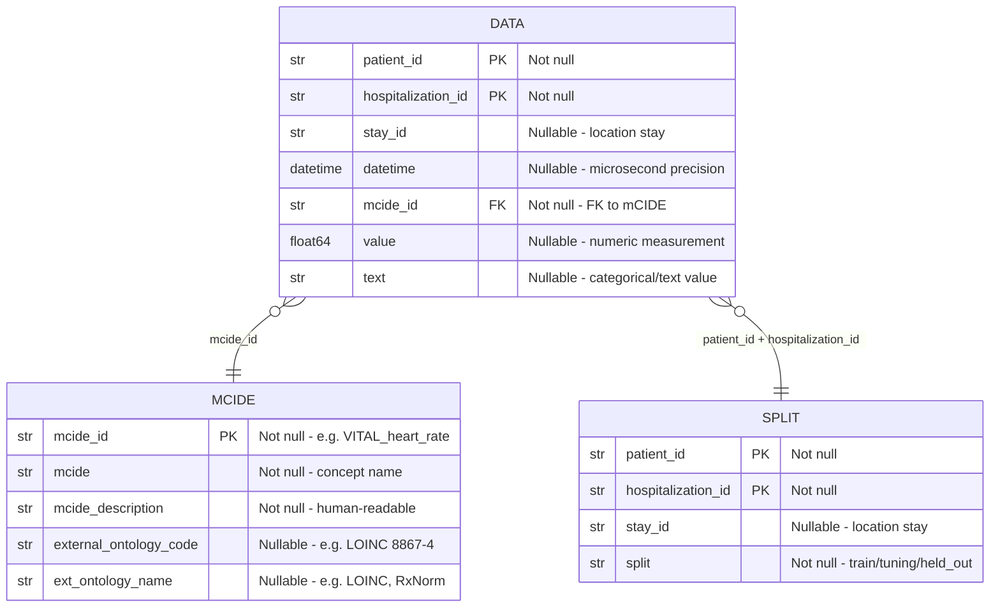

# ELF: Event-based Longitudinal Format

**Source-Agnostic ICU Event Format with mCIDE Ontology**

---

## Overview

ELF defines a **source-agnostic** event format for ICU data where every clinical event is grounded in the **mCIDE** (minimum Common ICU Data Elements) ontology. The format is independent of input data source — CLIF, MIMIC, eICU, or any other ICU dataset can produce ELF output through source-specific configuration files.

### Comparison to MEDS

| Feature | MEDS | ELF |
|---------|------|-----|
| Schema | Single flat table | 3 normalized tables |
| Ontology | None (free-text codes) | mCIDE with external ontology links |
| Concept IDs | Arbitrary strings | `{DOMAIN}_{concept}` scheme |
| Interoperability | Source-dependent | Source-agnostic via config |
| External codes | Not supported | LOINC, RxNorm, SNOMED CT |
| ICU-specific | General EHR | ICU-focused (120+ concepts) |
| Location tracking | Not built-in | `stay_id` with ADT-derived stays |

---

## Entity-Relationship Diagram



---

## Output Tables

### data.parquet — Event Data

The central fact table. Each row is one clinical event.

| Column | Type | Nullable | Description |
|--------|------|----------|-------------|
| `patient_id` | `str` | No | Patient identifier |
| `hospitalization_id` | `str` | No | Hospitalization identifier |
| `stay_id` | `str` | Yes | Location stay ID (e.g., `H001_1`, `H001_2`) |
| `datetime` | `datetime[us]` | Yes | Event timestamp (microsecond precision) |
| `mcide_id` | `str` | No | Foreign key to mCIDE.parquet |
| `value` | `float64` | Yes | Numeric measurement |
| `text` | `str` | Yes | Categorical/text value |

**Constraints:**
- `mcide_id` must exist in `mCIDE.parquet`
- For `type: value` concepts: `value` is populated, `text` is null
- For `type: text` concepts: `text` is populated, `value` is null
- For `type: presence` concepts: `value` = 1.0, `text` is null
- `datetime` is null only for static demographics (sex, race, ethnicity)

### mCIDE.parquet — Ontology

The dimension table defining all mCIDE concepts. Built from config files at conversion time.

| Column | Type | Nullable | Description |
|--------|------|----------|-------------|
| `mcide_id` | `str` (PK) | No | e.g., `VITAL_heart_rate`, `LAB_creatinine` |
| `mcide` | `str` | No | Concept name (e.g., `heart_rate`, `creatinine`) |
| `mcide_description` | `str` | No | Human-readable description |
| `external_ontology_code` | `str` | Yes | e.g., LOINC `8867-4` |
| `ext_ontology_name` | `str` | Yes | e.g., `LOINC`, `RxNorm` |

**Constraints:**
- `mcide_id` is the primary key (unique, not null)
- `mcide` is derived from `mcide_id` by stripping the domain prefix

### split.parquet — Cohort Splits

Patient-level random assignment for ML workflows.

| Column | Type | Nullable | Description |
|--------|------|----------|-------------|
| `patient_id` | `str` | No | Patient identifier |
| `hospitalization_id` | `str` | No | Hospitalization identifier |
| `stay_id` | `str` | Yes | Location stay ID |
| `split` | `str` | No | `train`, `tuning`, or `held_out` |

**Constraints:**
- All hospitalizations for a patient are in the same split
- Default ratio: 70% train, 15% tuning, 15% held_out
- Deterministic with seed=42

---

## mCIDE ID Scheme

Format: `{DOMAIN}_{concept_name}`

| Domain | Prefix | Description | Count |
|--------|--------|-------------|-------|
| Vitals | `VITAL_` | Vital signs | 9 |
| Labs | `LAB_` | Laboratory results | 38 |
| Medications | `MED_` | Continuous infusions | 28 |
| Respiratory | `RESP_` | Respiratory support parameters | 20 |
| Assessments | `ASSESS_` | Clinical assessment scales | 2 |
| Therapies | `THERAPY_` | Organ support therapies | 2 |
| Demographics | `DEMO_` | Patient demographics | 5 |
| ADT | `ADT_` | Admissions/discharges/transfers | 1 |
| Diagnoses | `DIAG_` | Diagnosis-derived comorbidities | 31 |
| **Total** | | | **136** |

---

## mCIDE Concept Catalog

### VITAL — Vital Signs (9 concepts)

| mcide_id | Description | External Code |
|----------|-------------|---------------|
| `VITAL_heart_rate` | Heart rate (beats per minute) | LOINC `8867-4` |
| `VITAL_systolic_blood_pressure` | Systolic blood pressure (mmHg) | LOINC `8480-6` |
| `VITAL_diastolic_blood_pressure` | Diastolic blood pressure (mmHg) | LOINC `8462-4` |
| `VITAL_mean_arterial_pressure` | Mean arterial pressure (mmHg) | LOINC `8478-0` |
| `VITAL_respiratory_rate` | Respiratory rate (breaths/min) | LOINC `9279-1` |
| `VITAL_oxygen_saturation` | Peripheral oxygen saturation (%) | LOINC `59408-5` |
| `VITAL_temperature` | Body temperature (Celsius) | LOINC `8310-5` |
| `VITAL_weight` | Body weight (kg) | LOINC `29463-7` |
| `VITAL_height` | Height (cm) | LOINC `8302-2` |

### LAB — Laboratory Results (38 concepts)

| mcide_id | Description | External Code |
|----------|-------------|---------------|
| `LAB_albumin` | Serum albumin (g/dL) | LOINC `1751-7` |
| `LAB_alkaline_phosphatase` | Alkaline phosphatase (U/L) | LOINC `6768-6` |
| `LAB_alt` | Alanine aminotransferase (U/L) | LOINC `1742-6` |
| `LAB_ast` | Aspartate aminotransferase (U/L) | LOINC `1920-8` |
| `LAB_bicarbonate` | Serum bicarbonate (mEq/L) | LOINC `1963-8` |
| `LAB_bilirubin_conjugated` | Conjugated (direct) bilirubin (mg/dL) | LOINC `1968-7` |
| `LAB_bilirubin_total` | Total bilirubin (mg/dL) | LOINC `1975-2` |
| `LAB_bun` | Blood urea nitrogen (mg/dL) | LOINC `3094-0` |
| `LAB_calcium_total` | Total calcium (mg/dL) | LOINC `17861-6` |
| `LAB_chloride` | Serum chloride (mEq/L) | LOINC `2075-0` |
| `LAB_creatinine` | Serum creatinine (mg/dL) | LOINC `2160-0` |
| `LAB_crp` | C-reactive protein (mg/L) | LOINC `1988-5` |
| `LAB_esr` | Erythrocyte sedimentation rate (mm/hr) | LOINC `4537-7` |
| `LAB_ferritin` | Serum ferritin (ng/mL) | LOINC `2276-4` |
| `LAB_glucose_fingerstick` | Fingerstick glucose (mg/dL) | LOINC `41653-7` |
| `LAB_glucose_serum` | Serum glucose (mg/dL) | LOINC `2345-7` |
| `LAB_hemoglobin` | Hemoglobin (g/dL) | LOINC `718-7` |
| `LAB_inr` | International normalized ratio | LOINC `6301-6` |
| `LAB_lactate` | Serum lactate (mmol/L) | LOINC `2524-7` |
| `LAB_ldh` | Lactate dehydrogenase (U/L) | LOINC `2532-0` |
| `LAB_magnesium` | Serum magnesium (mg/dL) | LOINC `19123-9` |
| `LAB_neutrophils_absolute` | Absolute neutrophil count (10^3/uL) | LOINC `751-8` |
| `LAB_pco2_arterial` | Arterial pCO2 (mmHg) | LOINC `2019-8` |
| `LAB_pco2_venous` | Venous pCO2 (mmHg) | LOINC `2021-4` |
| `LAB_ph_arterial` | Arterial blood pH | LOINC `2744-1` |
| `LAB_ph_venous` | Venous blood pH | LOINC `2746-6` |
| `LAB_phosphate` | Serum phosphate (mg/dL) | LOINC `2777-1` |
| `LAB_platelet_count` | Platelet count (10^3/uL) | LOINC `777-3` |
| `LAB_po2_arterial` | Arterial pO2 (mmHg) | LOINC `2703-7` |
| `LAB_potassium` | Serum potassium (mEq/L) | LOINC `2823-3` |
| `LAB_procalcitonin` | Procalcitonin (ng/mL) | LOINC `33959-8` |
| `LAB_ptt` | Partial thromboplastin time (seconds) | LOINC `3173-2` |
| `LAB_so2_arterial` | Arterial oxygen saturation (%) | LOINC `2708-6` |
| `LAB_so2_central_venous` | Central venous oxygen saturation (%) | LOINC `2674-0` |
| `LAB_sodium` | Serum sodium (mEq/L) | LOINC `2951-2` |
| `LAB_total_protein` | Total protein (g/dL) | LOINC `2885-2` |
| `LAB_troponin_i` | Troponin I (ng/mL) | LOINC `10839-9` |
| `LAB_wbc` | White blood cell count (10^3/uL) | LOINC `6690-2` |

### MED — Continuous Medications (28 concepts)

| mcide_id | Description | Preferred Unit | External Code |
|----------|-------------|----------------|---------------|
| `MED_amiodarone` | Amiodarone continuous infusion | mg/min | RxNorm `703` |
| `MED_angiotension` | Angiotensin II continuous infusion | ng/kg/min | RxNorm `54552` |
| `MED_cisatracurium` | Cisatracurium continuous infusion | mcg/kg/min | RxNorm `26195` |
| `MED_dexmedetomidine` | Dexmedetomidine continuous infusion | mcg/kg/hr | RxNorm `32624` |
| `MED_diltiazem` | Diltiazem continuous infusion | mg/hr | RxNorm `3443` |
| `MED_dobutamine` | Dobutamine continuous infusion | mcg/kg/min | RxNorm `3616` |
| `MED_dopamine` | Dopamine continuous infusion | mcg/kg/min | RxNorm `3628` |
| `MED_epinephrine` | Epinephrine continuous infusion | mcg/kg/min | RxNorm `3992` |
| `MED_esmolol` | Esmolol continuous infusion | mcg/kg/min | RxNorm `49737` |
| `MED_fentanyl` | Fentanyl continuous infusion | mcg/kg/hr | RxNorm `4337` |
| `MED_hydromorphone` | Hydromorphone continuous infusion | mg/hr | RxNorm `3423` |
| `MED_ketamine` | Ketamine continuous infusion | mcg/kg/hr | RxNorm `6130` |
| `MED_labetalol` | Labetalol continuous infusion | mg/min | RxNorm `6185` |
| `MED_lidocaine` | Lidocaine continuous infusion | mg/min | RxNorm `6387` |
| `MED_lorazepam` | Lorazepam continuous infusion | mg/hr | RxNorm `6470` |
| `MED_midazolam` | Midazolam continuous infusion | mg/hr | RxNorm `6960` |
| `MED_milrinone` | Milrinone continuous infusion | mcg/kg/min | RxNorm `52769` |
| `MED_nicardipine` | Nicardipine continuous infusion | mg/hr | RxNorm `7396` |
| `MED_nitroprusside` | Nitroprusside continuous infusion | mcg/kg/min | RxNorm `7435` |
| `MED_norepinephrine` | Norepinephrine continuous infusion | mcg/kg/min | RxNorm `7512` |
| `MED_pentobarbital` | Pentobarbital continuous infusion | mcg/kg/hr | RxNorm `8137` |
| `MED_phenylephrine` | Phenylephrine continuous infusion | mcg/kg/min | RxNorm `8163` |
| `MED_procainamide` | Procainamide continuous infusion | mg/min | RxNorm `8591` |
| `MED_propofol` | Propofol continuous infusion | mcg/kg/min | RxNorm `8782` |
| `MED_remifentanil` | Remifentanil continuous infusion | mcg/kg/min | RxNorm `73032` |
| `MED_rocuronium` | Rocuronium continuous infusion | mcg/kg/min | RxNorm `68139` |
| `MED_vasopressin` | Vasopressin continuous infusion | u/min | RxNorm `11149` |
| `MED_vecuronium` | Vecuronium continuous infusion | mcg/kg/min | RxNorm `11170` |

### RESP — Respiratory Support (20 concepts)

| mcide_id | Description | External Code |
|----------|-------------|---------------|
| `RESP_device_category` | Respiratory device type (text) | — |
| `RESP_mode_category` | Ventilator mode (text) | — |
| `RESP_tracheostomy` | Tracheostomy presence (1=present) | — |
| `RESP_fio2_set` | FiO2, set (%) | LOINC `3150-0` |
| `RESP_lpm_set` | O2 flow rate, set (L/min) | LOINC `3151-8` |
| `RESP_tidal_volume_set` | Tidal volume, set (mL) | LOINC `76222-9` |
| `RESP_resp_rate_set` | Respiratory rate, set (breaths/min) | LOINC `76334-2` |
| `RESP_pressure_control_set` | Pressure control, set (cmH2O) | LOINC `76531-3` |
| `RESP_pressure_support_set` | Pressure support, set (cmH2O) | LOINC `76530-5` |
| `RESP_flow_rate_set` | Inspiratory flow rate, set (L/min) | — |
| `RESP_peak_inspiratory_pressure_set` | PIP, set (cmH2O) | LOINC `76259-1` |
| `RESP_inspiratory_time_set` | Inspiratory time, set (seconds) | LOINC `76229-4` |
| `RESP_peep_set` | PEEP, set (cmH2O) | LOINC `76248-4` |
| `RESP_tidal_volume_obs` | Tidal volume, observed (mL) | LOINC `76009-0` |
| `RESP_resp_rate_obs` | Respiratory rate, observed (breaths/min) | LOINC `76270-8` |
| `RESP_plateau_pressure_obs` | Plateau pressure, observed (cmH2O) | LOINC `76259-1` |
| `RESP_peak_inspiratory_pressure_obs` | PIP, observed (cmH2O) | LOINC `76275-7` |
| `RESP_peep_obs` | PEEP, observed (cmH2O) | LOINC `76248-4` |
| `RESP_minute_vent_obs` | Minute ventilation, observed (L/min) | LOINC `76009-0` |
| `RESP_mean_airway_pressure_obs` | Mean airway pressure, observed (cmH2O) | LOINC `76530-5` |

### ASSESS — Clinical Assessments (2 concepts)

| mcide_id | Description | External Code |
|----------|-------------|---------------|
| `ASSESS_gcs_total` | Glasgow Coma Scale total score (3-15) | LOINC `9269-2` |
| `ASSESS_rass` | Richmond Agitation-Sedation Scale (-5 to +4) | LOINC `54632-5` |

### THERAPY — Organ Support Therapies (2 concepts)

| mcide_id | Description | External Code |
|----------|-------------|---------------|
| `THERAPY_crrt` | Continuous renal replacement therapy | — |
| `THERAPY_ecmo_mcs` | ECMO / mechanical circulatory support | — |

### DEMO — Demographics (5 concepts)

| mcide_id | Description | Type | External Code |
|----------|-------------|------|---------------|
| `DEMO_age_at_admission` | Age at hospital admission (years) | value | — |
| `DEMO_sex` | Patient biological sex | text | — |
| `DEMO_race` | Patient race category | text | — |
| `DEMO_ethnicity` | Patient ethnicity category | text | — |
| `DEMO_discharge_category` | Hospital discharge disposition | text | — |

### ADT — Admissions/Discharges/Transfers (1 concept)

| mcide_id | Description | Type | External Code |
|----------|-------------|------|---------------|
| `ADT_location_transfer` | Patient location (ED, ICU, Ward, etc.) | text | — |

### DIAG — Elixhauser Comorbidities (31 concepts)

| mcide_id | Description |
|----------|-------------|
| `DIAG_elixhauser_congestive_heart_failure` | Congestive heart failure |
| `DIAG_elixhauser_cardiac_arrhythmias` | Cardiac arrhythmias |
| `DIAG_elixhauser_valvular_disease` | Valvular disease |
| `DIAG_elixhauser_pulmonary_circulation_disorders` | Pulmonary circulation disorders |
| `DIAG_elixhauser_peripheral_vascular_disorders` | Peripheral vascular disorders |
| `DIAG_elixhauser_hypertension_uncomplicated` | Hypertension, uncomplicated |
| `DIAG_elixhauser_hypertension_complicated` | Hypertension, complicated |
| `DIAG_elixhauser_paralysis` | Paralysis |
| `DIAG_elixhauser_other_neurological_disorders` | Other neurological disorders |
| `DIAG_elixhauser_chronic_pulmonary_disease` | Chronic pulmonary disease |
| `DIAG_elixhauser_diabetes_uncomplicated` | Diabetes, uncomplicated |
| `DIAG_elixhauser_diabetes_complicated` | Diabetes, complicated |
| `DIAG_elixhauser_hypothyroidism` | Hypothyroidism |
| `DIAG_elixhauser_renal_failure` | Renal failure |
| `DIAG_elixhauser_liver_disease` | Liver disease |
| `DIAG_elixhauser_peptic_ulcer_disease_excluding_bleeding` | Peptic ulcer disease excluding bleeding |
| `DIAG_elixhauser_aids_hiv` | AIDS/HIV |
| `DIAG_elixhauser_lymphoma` | Lymphoma |
| `DIAG_elixhauser_metastatic_cancer` | Metastatic cancer |
| `DIAG_elixhauser_solid_tumor_without_metastasis` | Solid tumor without metastasis |
| `DIAG_elixhauser_rheumatoid_arthritis_collagen_vascular_disease` | Rheumatoid arthritis / collagen vascular disease |
| `DIAG_elixhauser_coagulopathy` | Coagulopathy |
| `DIAG_elixhauser_obesity` | Obesity |
| `DIAG_elixhauser_weight_loss` | Weight loss |
| `DIAG_elixhauser_fluid_and_electrolyte_disorders` | Fluid and electrolyte disorders |
| `DIAG_elixhauser_blood_loss_anemia` | Blood loss anemia |
| `DIAG_elixhauser_deficiency_anemia` | Deficiency anemia |
| `DIAG_elixhauser_alcohol_abuse` | Alcohol abuse |
| `DIAG_elixhauser_drug_abuse` | Drug abuse |
| `DIAG_elixhauser_psychoses` | Psychoses |
| `DIAG_elixhauser_depression` | Depression |

---

## stay_id Derivation

The `stay_id` column tracks patient location changes within a hospitalization. It is derived from the ADT (Admissions/Discharges/Transfers) table.

### Algorithm

1. Load ADT records for each hospitalization
2. Sort by `in_dttm` within each hospitalization
3. Assign rank (1, 2, 3, ...) based on temporal order
4. Format: `{hospitalization_id}_{rank}`

### Example

| hospitalization_id | location_category | in_dttm | stay_id |
|-------------------|-------------------|---------|---------|
| H001 | ED | 2024-01-01 08:00 | H001_1 |
| H001 | ICU | 2024-01-01 14:00 | H001_2 |
| H001 | Ward | 2024-01-03 10:00 | H001_3 |

### Event Assignment

Clinical events (vitals, labs, etc.) are assigned to the stay whose time window contains their timestamp. Events before the first ADT record or after the last are assigned to the nearest stay.

---

## Config-Driven Event Fetching

Each source (CLIF, MIMIC, eICU) has its own config directory under `config/`. Config files are self-contained event-fetching recipes.

### Event-Fetching Patterns

| Pattern | Config Example | Logic |
|---------|---------------|-------|
| **Category-filtered** | `vital_category.yaml` | Filter `category_column == filter` → extract `value_column` |
| **Category-as-text** | `device_category.yaml` | Read `category_column` value → put in `text` column |
| **Column-per-concept** | `respiratory_numeric.yaml` | Read `concept.column` → extract value |
| **Presence-based** | `crrt_therapy.yaml` | Each row = event with `value=1.0` |
| **Derived** | `hospital_diagnosis.yaml` | Compute via method (Elixhauser) → flags become events |

### Config File Structure

```yaml
# Common fields
filename: <source_table_name>
file_format: parquet
category_column: <optional - the _category column>
value_column: <optional - where measurements live>
timestamp_column: <optional - event timestamp>
id_column: <hospitalization_id or patient_id>

# Per-concept definitions
concepts:
  MCIDE_ID:
    filter: <category value to match>      # Pattern 1
    column: <source column name>           # Pattern 3
    type: value | text | presence          # Required
    description: "Human-readable"          # Required
    external_ontology_code: "..."          # Optional
    ext_ontology_name: "LOINC"             # Optional
```

### CLIF Config Files (17 total)

| Config File | Pattern | Source Table | Concepts |
|-------------|---------|-------------|----------|
| `vital_category.yaml` | Category-filtered | vitals | 9 |
| `lab_category.yaml` | Category-filtered | labs | 38 |
| `med_category.yaml` | Category-filtered | medication_admin_continuous | 28 |
| `assessment_category.yaml` | Category-filtered | patient_assessments | 2 |
| `device_category.yaml` | Category-as-text | respiratory_support | 1 |
| `mode_category.yaml` | Category-as-text | respiratory_support | 1 |
| `location_category.yaml` | Category-as-text | adt | 1 |
| `sex_category.yaml` | Category-as-text | patient | 1 |
| `race_category.yaml` | Category-as-text | patient | 1 |
| `ethnicity_category.yaml` | Category-as-text | patient | 1 |
| `discharge_category.yaml` | Category-as-text | hospitalization | 1 |
| `respiratory_numeric.yaml` | Column-per-concept | respiratory_support | 17 |
| `tracheostomy.yaml` | Column-per-concept | respiratory_support | 1 |
| `age_at_admission.yaml` | Column-per-concept | hospitalization | 1 |
| `crrt_therapy.yaml` | Presence-based | crrt_therapy | 1 |
| `ecmo_mcs.yaml` | Presence-based | ecmo_mcs | 1 |
| `hospital_diagnosis.yaml` | Derived | hospital_diagnosis | 31 |

---

## Split Logic

### Algorithm

1. Collect all unique `patient_id` values
2. Shuffle deterministically (seed=42)
3. Assign splits: 70% `train`, 15% `tuning`, 15% `held_out`
4. All hospitalizations and stays for a patient inherit the same split
5. Write one row per (`patient_id`, `hospitalization_id`, `stay_id`) combination

### Rationale

Patient-level splitting prevents data leakage — no patient appears in multiple splits.

---

## Pipeline Architecture

```
config/{source}/*.yaml       (event-fetching recipes)
         │
    ElfConverter
         │
    For each domain config:
      1. Load source file (filename from config)
      2. For each concept in config:
         - Apply filter/column extraction per pattern
         - Map to (patient_id, hospitalization_id, stay_id, datetime, mcide_id, value, text)
         │
    pl.concat(all_events) ──→ data.parquet
    build_mcide_df()       ──→ mCIDE.parquet   (from all concepts across configs)
    generate_splits()      ──→ split.parquet
```

---

## External Ontology Coverage

| Domain | Ontology | Coverage |
|--------|----------|----------|
| Vitals | LOINC | 9/9 (100%) |
| Labs | LOINC | 38/38 (100%) |
| Medications | RxNorm | 28/28 (100%) |
| Respiratory (numeric) | LOINC | 16/17 (94%) |
| Assessments | LOINC | 2/2 (100%) |
| Other domains | — | Not mapped (categorical/derived) |
